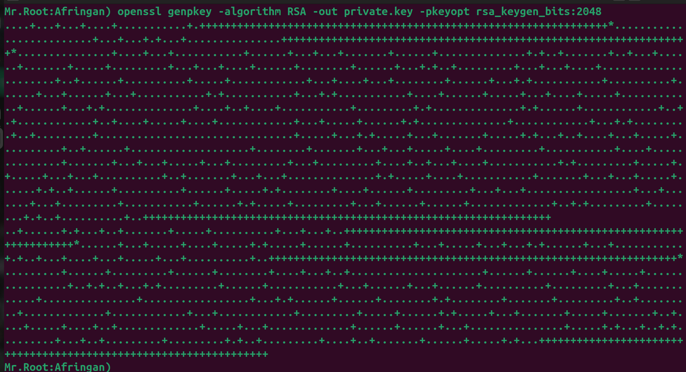
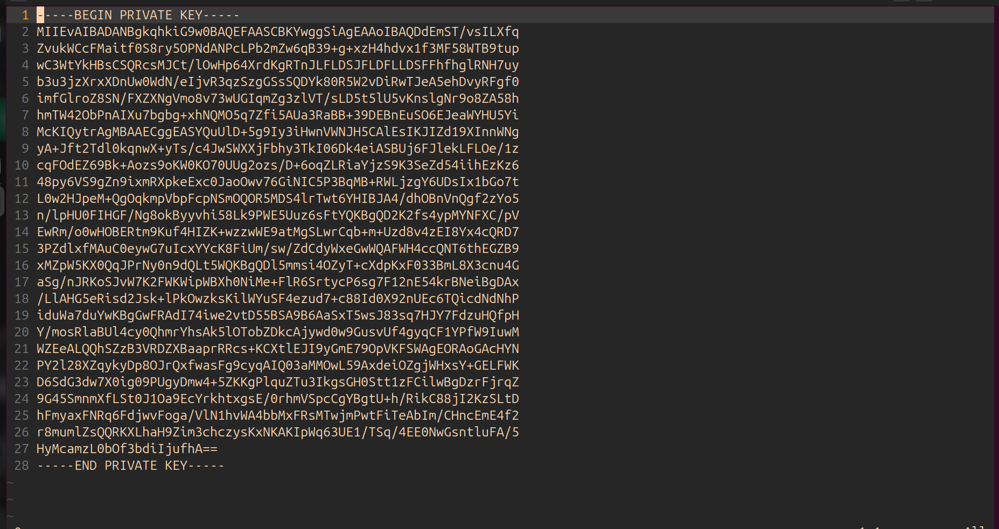
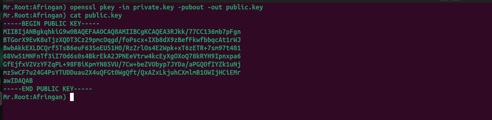
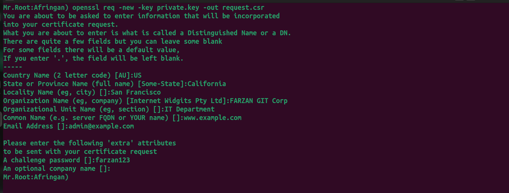
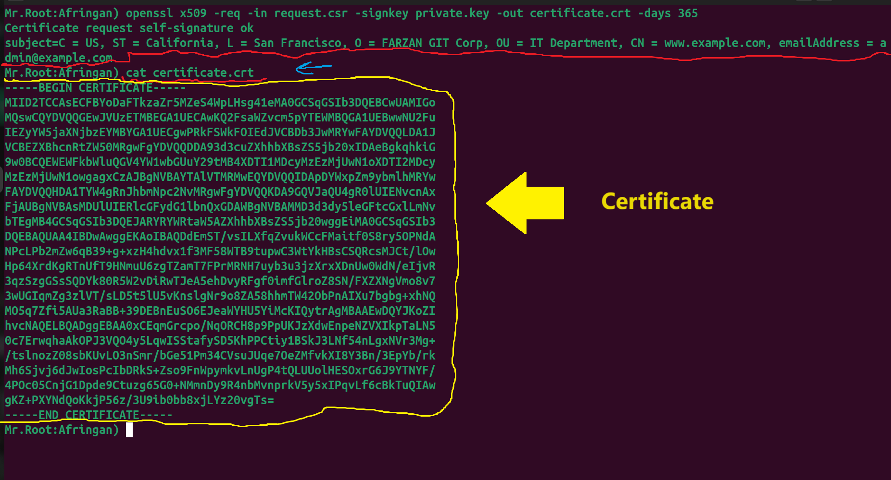
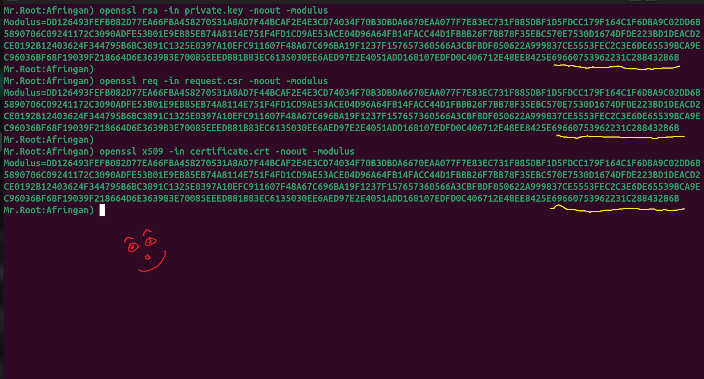

# How to Generate and Verify SSL Keys with OpenSSL – A Step-by-Step Guide

_A hands-on tutorial on creating private keys, public keys, CSRs, and certificates using OpenSSL._


## Table of Contents


## Table of Contents
1. [About OpenSSL](#about-openssl)
2. [Prerequisites](#prerequisites)
3. [Generating a Private Key](#generating-a-private-key)
4. [Extracting the Public Key](#extracting-the-public-key)
5. [Creating a CSR (Certificate Signing Request)](#creating-a-csr-certificate-signing-request)
6. [Self-Signing a Certificate](#self-signing-a-certificate)
7. [Verifying Key, CSR, and Certificate Match](#verifying-key-csr-and-certificate-match)
8. [License](#license)

---

## About OpenSSL

OpenSSL is a widely used open‑source toolkit that implements the Secure Sockets Layer (SSL) and Transport Layer Security (TLS) protocols, as well as a full‑featured cryptography library. It is the de facto industry standard, powering most HTTPS websites, email servers, VPNs, and many other security‑sensitive applications worldwide.


---
## Prerequisites

- OpenSSL installed (version X.X.X or newer)
- Basic familiarity with the terminal/shell
- A UNIX‑like environment (Linux, macOS, or WSL on Windows)

## Generating a Private Key

--

To generate a 2048‑bit RSA private key, run:

```bash
openssl genpkey -algorithm RSA -out private.key -pkeyopt rsa_keygen_bits:2048
```

- `genpkey`: the OpenSSL subcommand for key generation
- `-algorithm RSA`: specifies the RSA algorithm
- `-out private.key`: the output filename
- `-pkeyopt rsa_keygen_bits:2048`: key size in bits

This will create a file named `private.key` in your current directory.





⚠️ Note: The private key shown above is just an example. Each `openssl genpkey …` invocation generates a unique key—please run the command yourself to produce your own private key.

---

## Extracting the Public Key

Once you have your private key, you can extract the corresponding public key with:

```bash
openssl pkey -in private.key -pubout -out public.key
```

- `pkey`: the OpenSSL subcommand for public/private key processing

- `-in` private.key: specifies your private key file as input

- `pubout`: tells OpenSSL to output the public key

- `out` public.key: the filename to write the public key to

This command will generate a file named public.key containing your PEM‑encoded public key.



---

## Creating a CSR (Certificate Signing Request)

To generate a CSR using your private key, run:

```bash
openssl req -new -key private.key -out request.csr
```

You’ll be prompted to enter:

- Country Name (2 letter code): e.g., US

- State or Province Name: e.g., California

- Locality Name (city): e.g., San Francisco

- Organization Name: e.g., FARZAN GIT Corp

- Organizational Unit Name: e.g., IT Department

- Common Name (domain name): e.g., www.example.com

- Email Address: e.g., admin@example.com

- This creates request.csr containing your CSR in PEM format.



---

## Self-Signing a Certificate

To create a self‑signed certificate using your CSR and private key, run:

```bash
openssl x509 -req -in request.csr -signkey private.key -out certificate.crt -days 365
```

x509 -req: indicates you’re processing a CSR request

- in request.csr: specifies the CSR file as input

- signkey private.key: uses your private key to sign the certificate

- out certificate.crt: the output filename for your certificate

- days 365: the certificate validity period in days

# This command generates certificate.crt, a PEM‑encoded self‑signed certificate valid for 1 year.



---

## Verifying Key, CSR, and Certificate Match

To ensure that your RSA private key, CSR, and certificate all align, you can compare their modulus values:

```bash
# 1. Check private key modulus
openssl rsa -in private.key -noout -modulus

# 2. Check CSR modulus
openssl req -in request.csr -noout -modulus

# 3. Check certificate modulus
openssl x509 -in certificate.crt -noout -modulus

```

### Each command should output the same hexadecimal string. If they match, your files are correctly paired.




---

> 🎓 **Note:** All keys shown in the images have been generated solely for educational and demonstration purposes and have never been used on any server. To create and use your own keys, run the OpenSSL commands on your own system and avoid sharing your private keys or screenshots to prevent exposure of sensitive information or potential interception.

---
> 🚀 **Tip:** Always generate and manage your own keys in a secure environment—never rely on untrusted sources or share demo keys in production. This guide’s purpose is to show you how to use trustworthy OpenSSL commands to create strong, reliable keys.
---


## License

This project is licensed under the MIT License – see the [LICENSE](LICENSE) file for details.
